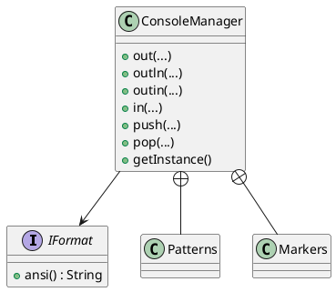

# ConsoleManager

Библиотека для консольного взаимодействия с пользователем на Java.

## Описание

ConsoleManager предоставляет инструменты для создания интерактивных консольных приложений с поддержкой:

- форматированного вывода через стили;
- управления стилями в формате stack
- вывод списков с пользовательской маркеровкой
- пользовательского ввода;
- ограничения вводимых символов;
- скрытого ввода;
- редактирования строки ввода;

---

# Этап 1. Требования

## Функциональные требования

### Вывод данных

Методы:

```java
void out(Object... out)
void outln(Object... out)
```

### Пользовательский ввод

Методы:

```java
String in(Pattern allowedPattern, int maxLength, boolean hiddenInput)
String outin(Object out, Pattern allowedPattern, int maxLength, boolean hiddenInput)
```

### Редактирование ввода

Поддерживаются:

- перемещение курсора;
- выделение текста;
- удаление выделения;
- копирование;
- вырезание;
- вставка.

### Форматирование текста

Поддерживаются:

- жирный текст;
- курсив;
- подчёркивание;
- двойное подчёркивание;
- мигание;
- инверсия;
- зачёркивание;
- произвольные цвета текста и фона.

---

# Этап 2. UML-диаграмма



---

# Этап 3. План тестирования

| ID | Проверка | Ожидаемый результат |
|----|-----------|---------------------|
| TP-01 | Singleton | Возвращается один экземпляр |
| TP-02 | listMarker | Маркер изменяется |
| TP-03 | listSeparator | Разделитель изменяется |
| TP-04 | replacementChars | Значение изменяется |
| TP-05 | ANSI форматы | Возвращаются корректные ANSI-коды |
| TP-06 | Цвет текста | Генерируется ANSI-код |
| TP-07 | Цвет фона | Генерируется ANSI-код |
| TP-08 | LATIN | Корректная проверка строки |
| TP-09 | CYRILLIC | Корректная проверка строки |
| TP-10 | INTEGER | Корректная проверка строки |
| TP-11 | DECIMAL | Корректная проверка строки |
| TP-12 | EMAIL | Корректная проверка строки |
| TP-13 | combine | Создаётся новый Pattern |

---

# Этап 4. Реализация тестирования

Для тестирования используется JUnit 5.

Покрываются:

- Singleton;
- конфигурация ConsoleManager;
- ANSI-форматы;
- генерация цветов;
- встроенные регулярные выражения;
- объединение регулярных выражений.

Интерактивный ввод не покрывается автоматическими тестами, так как зависит от пользовательских событий терминала.
